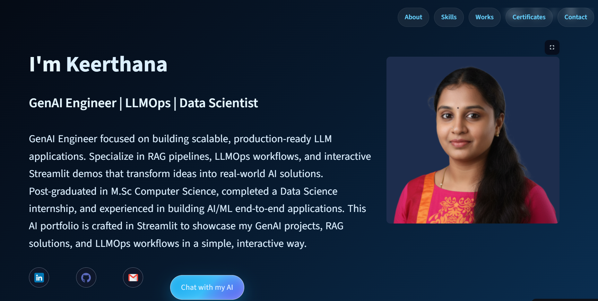

# Keerthana S – GenAI Portfolio (Live AI Assistant)

This repository contains my **live GenAI portfolio application**, built and deployed using **Streamlit**, showcasing my work in **GenAI, LLMOps, RAG systems, NLP, and Data Science**.  
The portfolio includes an interactive **AI assistant** designed to answer recruiter and interviewer questions in real time.

🌐 **Live App:**  
https://keerthana-ds-ghub-genai-portfolio-landing-dmqphl.streamlit.app/

## 🚀 Key Features
- Live **AI-powered assistant** for recruiter and interview interactions  
- Clean, recruiter-friendly UI built with Streamlit  
- Showcases projects, skills, certifications, and contact information  
- Multi-page navigation with production-ready deployment  
- Secure secret management and cloud deployment on Streamlit Cloud  

## 🛠️ Tech Stack
- **Frontend & App Framework:** Streamlit  
- **Programming:** Python  
- **LLM & GenAI:** Watsonx.ai, LangChain  
- **RAG & Vector Search:** ChromaDB, Embeddings  
- **Deployment:** Streamlit Cloud  
- **Version Control:** Git, GitHub  
- **UI Customization:** HTML, CSS  

## 📌 Purpose

This project demonstrates my ability to:

- Build **production-ready GenAI applications**  
- Apply **LLMOps best practices** to control and ground LLM behavior  
- Deploy and maintain **cloud-hosted AI systems**  
- Design **clean, professional user interfaces** for real users  

